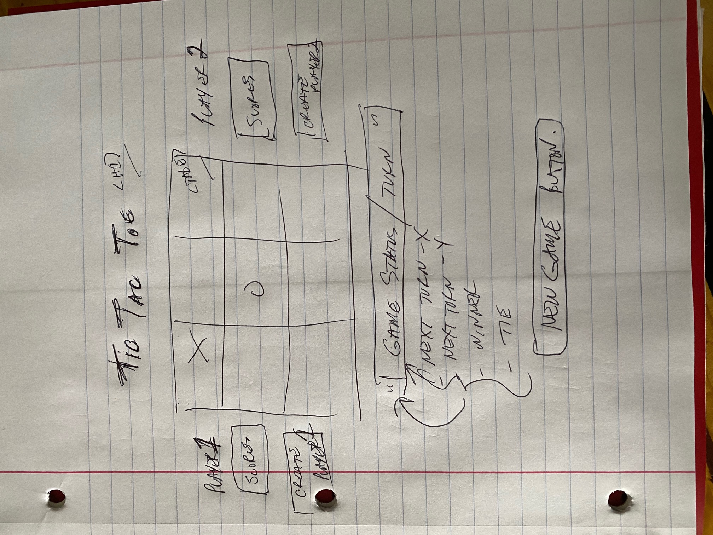

# Tic_Tac_Toe
Project 1 - Tic Tac Toe game
*******************************
Technologies used for project:
*******************************
HTML
CSS 
Javascript
DOM Selectors
Event Listeners
Event Handler functions

Most difficult logic was probably the winner for this project.  I used an array of winning combinations and had 2 other player arrays that represented player selections based on squares selected in the tic tac toe board.  Each time a player made a selection a nested for loop would look at the possible winning combinations and check each player's array of selections for a match on those winning combination.

A nice parameter I came across when setting event listeners so that they only trigger once was the "{once: true}".  This allowed an event listener to be triggered only once after set so that is did not need to be removed later in the logic.

A good learning experience was the setting and removing of event listeners thoughout the  game. 

*******************************
MVP for new product
*******************************
Initial goal of this project was to develop a basic tic tac toe game to be rendered in the browser.

Initial features:
Game will have a 3x3 table to be used as game board.
Player X will start the game each time.
Will switch between X and O as selections are made during the game.
Game visually displays winner or tie condition under the gameboard once condition is met.
Will not allow player to mark the same game square twice.
Once game is a win, lose ot tie it will not allow players to continue playing.
Players can play an additional game by selecting the "new game" button instead of refreshing page.

***********************************
Features added after MVP completed
***********************************
Additional features added:
Allow players to choose own name, letter or emoji to be used on scoreboard.
Track wins, losses, and ties for each player as games go on.
Provide a new game button to continue series between existing players.
Allow last winner of a game to go first in the next game.

Provide a new game new players button for a new set of players to play.

*******************************
User stories of project
*******************************
User stories created for both the initial MVP and also additions added to the MVP.

User Stories - for initial MVP project:
* As a user, I should be able to start a new tic tac toe game
* As a user, I should be able to click on a square to add X first and then O, and so on
* As a user, I should be shown a message after each turn for if I win, lose, tie or who's turn it is next
* As a user, I should not be able to click the same square twice
* As a user, I should be shown a message when I win, lose or tie
* As a user, I should not be able to continue playing once I win, lose, or tie
* As a user, I should be able to play the game again without refreshing the page

User Stories for added features:
* As a user, I should be able to see my wins, losses and ties as a series of games continues.
* As a user, I should be able to add my name, a letter or an emoji as my player identifier on the game board.
* As a user, I should be able to see a display for what name, letter or emoji player1 and player2 have selected.
* As a user, I should be able to let the last game winner go first in the next game played in a series.
* As a user, I should be able to start a new game for the two existing players.
* As a user, I should be able to start a new game for two new players.
* As a user, I should not be able to make any game selections until both new players are setup.
* As a user, I should not be able to start a new game between current players until both new players are added.

<!--  -->

*******************************
Wire Diagram for project
*******************************
Initial wire diagram below with some updates that were added when additional features added.

